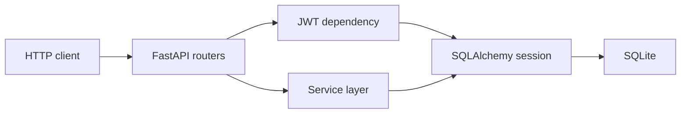

# Eagle Bank REST API

A versioned REST API built with FastAPI and SQLAlchemy. The project demonstrates the design and implementation of an authenticated HTTP API, including resource ownership, request validation, persistence, business rules, automated tests, and generated OpenAPI documentation.

## Features

- JWT bearer authentication with expiring access tokens
- User registration and self-service profile CRUD
- Bank account creation, listing, update, and deletion
- Deposits and withdrawals with balance validation
- Immutable transaction history
- Ownership checks across protected resources
- Consistent validation and error response shapes
- SQLite persistence with foreign-key enforcement
- Interactive Swagger UI and ReDoc documentation
- Optional Docker runtime

## API Overview

| Method             | Endpoint                                                    | Description                    |
| ------------------ | ----------------------------------------------------------- | ------------------------------ |
| `POST`             | `/v1/users`                                                 | Register a user                |
| `GET/PATCH/DELETE` | `/v1/users/{userId}`                                        | Manage the authenticated user  |
| `POST`             | `/v1/auth/login`                                            | Exchange credentials for a JWT |
| `POST/GET`         | `/v1/accounts`                                              | Create or list owned accounts  |
| `GET/PATCH/DELETE` | `/v1/accounts/{accountNumber}`                              | Manage an owned account        |
| `POST/GET`         | `/v1/accounts/{accountNumber}/transactions`                 | Create or list transactions    |
| `GET`              | `/v1/accounts/{accountNumber}/transactions/{transactionId}` | Fetch one transaction          |
| `GET`              | `/health`                                                   | Service health check           |

The full contract is available in [`openapi.yaml`](openapi.yaml) and from the running application at `/openapi.json`.

## Run Locally

Requires Python 3.12 or later.

```bash
python3 -m venv .venv
source .venv/bin/activate
python -m pip install -r requirements.txt
uvicorn app.main:app --reload
```

Open:

- API index: `http://127.0.0.1:8000/`
- Swagger UI: `http://127.0.0.1:8000/docs`
- ReDoc: `http://127.0.0.1:8000/redoc`
- Health check: `http://127.0.0.1:8000/health`

## Run With Docker

Docker packages the Python runtime and application dependencies into a repeatable image. The named volume keeps the SQLite database after the container stops.

```bash
docker build -t eagle-bank-api .
docker run --rm -p 8000:8000 \
  -e JWT_SECRET_KEY="replace-with-a-long-random-secret" \
  -e DATABASE_URL="sqlite:////data/eagle_bank.db" \
  -v eagle-bank-data:/data \
  eagle-bank-api
```

## Example

Register:

```bash
curl -X POST http://127.0.0.1:8000/v1/users \
  -H "Content-Type: application/json" \
  -d '{
    "name": "Test User",
    "address": {
      "line1": "1 High Street",
      "town": "Knutsford",
      "county": "Cheshire",
      "postcode": "WA16 6AA"
    },
    "phoneNumber": "+447700900123",
    "email": "user@example.com",
    "password": "correct-horse-battery"
  }'
```

Log in:

```bash
curl -X POST http://127.0.0.1:8000/v1/auth/login \
  -H "Content-Type: application/json" \
  -d '{"email":"user@example.com","password":"correct-horse-battery"}'
```

Use the returned token on protected routes:

```bash
curl http://127.0.0.1:8000/v1/accounts \
  -H "Authorization: Bearer <accessToken>"
```

## Architecture



- `app/routers/` defines the HTTP interface and status codes.
- `app/schemas/` validates request and response bodies with Pydantic.
- `app/services/` contains business logic and persistence operations.
- `app/models/` defines the SQLAlchemy database models.
- `tests/` exercises the API through an isolated database per test.

Transactions are append-only. Accounts with transaction history cannot be deleted, and users with existing accounts must remove those accounts before deleting their profile. These rules preserve relational and audit integrity.

## Tests

```bash
pytest
```

The suite covers authentication, validation, ownership boundaries, CRUD behavior, insufficient funds, balance limits, and deletion conflicts.

## Configuration

Configuration is read from environment variables:

- `APP_NAME`
- `API_VERSION`
- `DATABASE_URL`
- `JWT_SECRET_KEY`
- `JWT_ALGORITHM`
- `JWT_EXPIRY_SECONDS`

The defaults support local development. `JWT_SECRET_KEY` must be replaced in a deployed environment.

## License

Released under the [MIT License](LICENSE).
