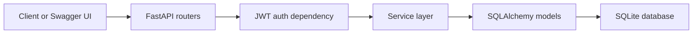

# Eagle Bank API

FastAPI implementation of the Eagle Bank take-home REST API, built against the supplied `openapi.yaml` contract with JWT authentication, user flows, account ownership enforcement, and automated tests.

## Quick Start

### Prerequisites

- Python 3
- Git

### Install and run

```bash
python3 -m venv .venv
source .venv/bin/activate
pip install -r requirements.txt
uvicorn app.main:app --reload
```

Once running, the main URLs are:

- `http://127.0.0.1:8000/health`
- `http://127.0.0.1:8000/docs`

## Run Tests

```bash
pytest
```

## Reviewer Guide

If reviewing the project quickly, the most useful order is:

1. `README.md` for setup, scope, and tradeoffs
2. `openapi.yaml` for the API contract
3. `http://127.0.0.1:8000/docs` for the live FastAPI-generated documentation
4. `tests/test_user_auth.py`, `tests/test_accounts.py`, and `tests/test_transactions.py` for executable behaviour
5. `docs/implementation-checklist.md` for implemented vs deferred work
6. `JACK_NOTES.md` for design reasoning and working notes

The implementation checklist is the clearest single view of what is complete, what was prioritised, and which tradeoffs were left explicit for discussion.

## Scope Note

This README does not repeat the full endpoint-by-endpoint implementation list. The detailed view of completed and deferred scenarios lives in `docs/implementation-checklist.md`, which follows the supplied take-home scenarios more closely.

## Example Flow

Create a user:

```bash
curl -X POST http://127.0.0.1:8000/v1/users \
  -H "Content-Type: application/json" \
  -d '{
    "name": "Test User",
    "address": {
      "line1": "1 High Street",
      "town": "Knutsford",
      "county": "Cheshire",
      "postcode": "WA16 6AA"
    },
    "phoneNumber": "+447700900123",
    "email": "user@example.com",
    "password": "correct-horse-battery"
  }'
```

Log in and get a bearer token:

```bash
curl -X POST http://127.0.0.1:8000/v1/auth/login \
  -H "Content-Type: application/json" \
  -d '{
    "email": "user@example.com",
    "password": "correct-horse-battery"
  }'
```

Create an account with that token:

```bash
curl -X POST http://127.0.0.1:8000/v1/accounts \
  -H "Content-Type: application/json" \
  -H "Authorization: Bearer <accessToken>" \
  -d '{
    "name": "Daily Account",
    "accountType": "personal"
  }'
```

## Project Structure

- `app/` FastAPI application code
- `app/routers/` HTTP routes
- `app/services/` business logic
- `app/models/` SQLAlchemy models
- `app/schemas/` request and response schemas
- `tests/` API tests
- `docs/` supporting notes and implementation tracking
- `openapi.yaml` API contract used as the implementation reference

## Design Decisions and Tradeoffs

- FastAPI was chosen because it maps cleanly to an OpenAPI-driven workflow and provides useful live documentation at `/docs`.
- SQLite keeps local setup simple for a take-home exercise and avoids extra infrastructure, at the cost of file-based locking limitations during development.
- SQLite foreign-key enforcement is turned on explicitly, because SQLite does not enable it by default and I still wanted relational integrity checks to behave like a real database-backed service.
- JWT bearer authentication matches the supplied security scheme and keeps protected route checks consistent.

## Additional Integrity Decision

- I added one explicit rule beyond the base happy path: an account cannot be deleted once it has transaction history.
- This is called out separately because it is an implementation decision to preserve relational and audit integrity, rather than a claim that the supplied brief spelled it out verbatim.

## Request Flow



## Notes

- The original PDF brief is intentionally not committed. This repository keeps the implementation-facing contract in `openapi.yaml` while omitting the supplied interview materials.
- AI assistance was used to accelerate scaffolding and boilerplate. The resulting code was reviewed, shaped, and tested rather than treated as trusted output.
- SQLite is file-based, so there is no separate database server to start.
